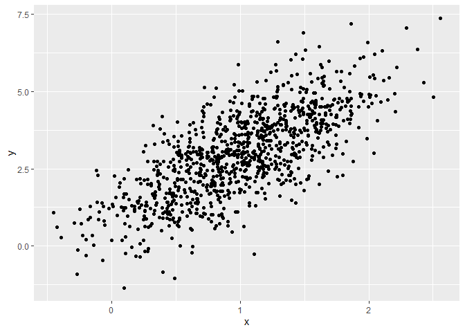
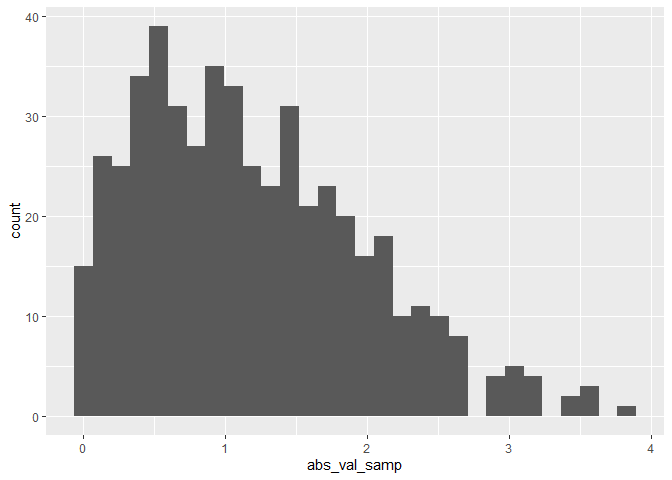

Simple document
================
Sijda Ahmed
2025-09-11

I’m an R Markdown document!

``` r
library(tidyverse)
library(ggplot2)
```

# Section 1

Here’s a **code chunk** that samples from a *normal distribution*:

``` r
samp = rnorm(100)
length(samp)
```

    ## [1] 100

# Section 2

I can take the mean of the sample, too! The mean is -0.1575038.

# Section 3

This is where I’m going to to talk about code chunks.

``` r
mean(samp)
```

    ## [1] -0.1575038

``` r
sd(samp)
```

    ## [1] 0.9791916

Let’s also make a dataframe.

``` r
example_df = 
  tibble(
    vec_numeric = 1:4,
    vec_char = c("My", "name", "is", "jeff"),
    vec_factor = factor(c("male", "male", "female", "female"))
  )
```

I’ll create a new dataframe.

``` r
new_df = 
  tibble(
    x = rnorm(100),
    y = 1 + 2 * x + rnorm(100)
  )
```

Let’s make a plot and see how cool that is!

``` r
plot_df = 
  tibble(
    x = rnorm(1000, mean = 1, sd = .5),
    y = 1 + 2 * x + rnorm(1000)
  )

ggplot(plot_df, aes(x = x, y = y)) + geom_point()
```

<!-- -->

This is a neat scatterplot!

# Learning Assesement

This chunk does one of the LA.

``` r
la_df =
  tibble(
    numeric_samp = rnorm(500, mean=1),
    greather_0 = numeric_samp > 0,
    abs_val_samp = abs(numeric_samp)
  )

ggplot(la_df, aes(x = abs_val_samp)) + geom_histogram()
```

    ## `stat_bin()` using `bins = 30`. Pick better value with `binwidth`.

<!-- -->

``` r
median_samp = median(pull(la_df, numeric_samp))
```

The median of the variable containing absolute values is 1.05.

“The sample size in the new dataframe is 500.”

Something more complex is “The mean of my new variable is1.1867634.”

If I want to talk about `la_df`, I would use the backticks.
